# 📊 ESTRUCTURA DE BASE DE DATOS - RADIO ORIENTE

## 📋 RESUMEN EJECUTIVO

- **Total de Tablas en Supabase:** 43 tablas
- **Total de Modelos Django:** 38 modelos
- **Apps Personalizadas:** 10 apps
- **Tablas Faltantes:** 5 (necesitan migración)
- **Tablas Huérfanas:** 6 (django-allauth no usado)

---

## 🗺️ DIAGRAMA DE RELACIONES COMPLETO

```mermaid
erDiagram
    %% USUARIOS Y AUTENTICACIÓN
    Usuario {
        int id PK
        string username UK
        string email UK
        string first_name
        string last_name
        bool is_staff
        bool is_superuser
        datetime fecha_creacion
        bool chat_bloqueado
    }

    %% UBICACIÓN GEOGRÁFICA
    Pais {
        int id PK
        string nombre UK
    }

    Region {
        int id PK
        string nombre UK
        string codigo_iso
        int orden
    }

    Ciudad {
        int id PK
        string nombre
        int pais_id FK
    }

    Comuna {
        int id PK
        string nombre
        int ciudad_id FK
    }

    %% RADIO Y PROGRAMACIÓN
    EstacionRadio {
        int id PK
        string nombre
        text descripcion
        string stream_url
        string telefono
        string email
        int listeners_count
        bool activo
    }

    GeneroMusical {
        int id PK
        string nombre UK
        text descripcion
    }

    Conductor {
        int id PK
        string nombre
        string apellido
        string apodo
        string foto_url
        string email UK
        bool activo
    }

    Programa {
        int id PK
        string nombre
        text descripcion
        string imagen_url
        bool activo
    }

    ProgramaConductor {
        int id PK
        int programa_id FK
        int conductor_id FK
    }

    HorarioPrograma {
        int id PK
        int programa_id FK
        int dia_semana
        time hora_inicio
        time hora_fin
        bool activo
    }

    %% ARTÍCULOS Y BLOG
    Categoria {
        int id PK
        string nombre UK
        text descripcion
        string slug UK
    }

    Articulo {
        int id PK
        string titulo
        string slug UK
        text contenido
        text resumen
        string imagen_portada
        string imagen_url
        int autor_id FK
        int categoria_id FK
        bool publicado
        bool destacado
        datetime fecha_publicacion
        int vistas
    }

    ComentarioArticulo {
        int id PK
        int articulo_id FK
        int autor_id FK
        text contenido
        datetime fecha_creacion
        bool activo
    }

    %% CHAT EN VIVO
    ChatMessage {
        int id PK
        int id_usuario
        text contenido
        datetime fecha_envio
        string usuario_nombre
        string tipo
        string sala
    }

    %% CONTACTO Y SUSCRIPCIONES
    TipoAsunto {
        int id PK
        string nombre UK
        text descripcion
    }

    Estado {
        int id PK
        string nombre
        text descripcion
        string tipo_entidad
    }

    Contacto {
        int id PK
        string nombre
        string email
        string telefono
        int tipo_asunto_id FK
        text mensaje
        int usuario_id FK
        int estado_id FK
        datetime fecha_envio
        int respondido_por_id FK
    }

    Suscripcion {
        int id PK
        string email UK
        string nombre
        bool activa
        datetime fecha_suscripcion
        int usuario_id FK
    }

    %% BANDAS EMERGENTES
    Integrante {
        int id PK
        string nombre
    }

    BandaEmergente {
        int id PK
        string nombre_banda
        string email_contacto
        string telefono_contacto
        text mensaje
        string documento_presentacion
        int genero_id FK
        int usuario_id FK
        int estado_id FK
        int comuna_id FK
        int revisado_por_id FK
        datetime fecha_envio
    }

    BandaIntegrante {
        int id PK
        int banda_id FK
        int integrante_id FK
    }

    BandaLink {
        int id PK
        int banda_id FK
        string tipo
        string url
    }

    %% PUBLICIDAD (Sistema Legacy)
    Publicidad {
        int id PK
        string nombre_cliente
        text descripcion
        string tipo
        date fecha_inicio
        date fecha_fin
        bool activo
        decimal costo_total
        int usuario_id FK
    }

    PublicidadWeb {
        int id PK
        int publicidad_id FK
        string ubicacion
        string formato
        string url_destino
        int impresiones
        int clics
    }

    PublicidadRadial {
        int id PK
        int publicidad_id FK
        int horario_id FK
        int duracion_segundos
        decimal valor_por_segundo
        decimal costo_total
    }

    %% PUBLICIDAD (Sistema Self-Service)
    EspacioPublicitario {
        int id PK
        string nombre
        string codigo UK
        string ubicacion
        int ancho_px
        int alto_px
        json formatos_permitidos
        decimal precio_por_dia
        bool activo
    }

    SolicitudPublicidad {
        int id PK
        int usuario_id FK
        string nombre_cliente
        string email
        string estado
        decimal monto_estimado
        datetime fecha_creacion
    }

    ItemSolicitud {
        int id PK
        int solicitud_id FK
        int espacio_id FK
        date fecha_inicio
        date fecha_fin
        decimal precio_dia
        decimal subtotal
    }

    CreatividadPublicitaria {
        int id PK
        int item_id FK
        file archivo
        int ancho_px_detectado
        int alto_px_detectado
        bool valido
        datetime fecha_subida
    }

    %% NOTIFICACIONES
    Notification {
        int id PK
        int usuario_id FK
        string tipo
        string titulo
        text mensaje
        bool leido
        datetime fecha_creacion
        string enlace
    }

    %% RELACIONES - UBICACIÓN
    Pais ||--o{ Ciudad : tiene
    Ciudad ||--o{ Comuna : contiene
    Comuna ||--o{ BandaEmergente : ubicacion

    %% RELACIONES - RADIO
    Programa ||--o{ ProgramaConductor : tiene
    Conductor ||--o{ ProgramaConductor : participa
    Programa ||--o{ HorarioPrograma : horarios
    HorarioPrograma ||--o{ PublicidadRadial : publicidades

    %% RELACIONES - ARTÍCULOS
    Usuario ||--o{ Articulo : escribe
    Categoria ||--o{ Articulo : clasifica
    Articulo ||--o{ ComentarioArticulo : tiene
    Usuario ||--o{ ComentarioArticulo : comenta

    %% RELACIONES - CONTACTO
    TipoAsunto ||--o{ Contacto : clasifica
    Estado ||--o{ Contacto : estado
    Usuario ||--o{ Contacto : envia
    Usuario ||--o{ Contacto : responde
    Usuario ||--o{ Suscripcion : suscribe

    %% RELACIONES - BANDAS EMERGENTES
    GeneroMusical ||--o{ BandaEmergente : genero
    Estado ||--o{ BandaEmergente : estado
    Usuario ||--o{ BandaEmergente : registra
    Usuario ||--o{ BandaEmergente : revisa
    BandaEmergente ||--o{ BandaIntegrante : tiene
    Integrante ||--o{ BandaIntegrante : integra
    BandaEmergente ||--o{ BandaLink : enlaces

    %% RELACIONES - PUBLICIDAD LEGACY
    Usuario ||--o{ Publicidad : contrata
    Publicidad ||--|| PublicidadWeb : detalles_web
    Publicidad ||--|| PublicidadRadial : detalles_radial

    %% RELACIONES - PUBLICIDAD SELF-SERVICE
    Usuario ||--o{ SolicitudPublicidad : solicita
    SolicitudPublicidad ||--o{ ItemSolicitud : items
    EspacioPublicitario ||--o{ ItemSolicitud : espacio
    ItemSolicitud ||--o{ CreatividadPublicitaria : creatividades

    %% RELACIONES - NOTIFICACIONES
    Usuario ||--o{ Notification : recibe
```



---

## 🏗️ ESTRUCTURA POR APPS

### 1️⃣ **apps.ubicacion** - Ubicación Geográfica
**Tablas:** 3
```
📍 Pais
   └── Ciudad
        └── Comuna
```

**Relaciones Externas:**
- `Comuna` → usado por `BandaEmergente`

---

### 2️⃣ **apps.users** - Sistema de Usuarios
**Tablas:** 3 (usuario + 2 M2M automáticas)
```
👤 Usuario (Usuario personalizado)
   ├── usuario_groups
   └── usuario_user_permissions
```

**Campo Especial:**
- `chat_bloqueado` (bool) - Para moderar el chat

**Relaciones Externas:** ⭐ **Centro del sistema - 22 relaciones**
- Articulo.autor
- ComentarioArticulo.autor
- Contacto.usuario
- Contacto.respondido_por
- Suscripcion.usuario
- BandaEmergente.usuario
- BandaEmergente.revisado_por
- Publicidad.usuario
- SolicitudPublicidad.usuario
- Notification.usuario

---

### 3️⃣ **apps.radio** - Gestión de Radio
**Tablas:** 5
```
📻 EstacionRadio (independiente)
🎵 GeneroMusical (independiente)
🎤 Conductor
   └── ProgramaConductor ←→ Programa
                             └── HorarioPrograma
```

**Relaciones Externas:**
- `GeneroMusical` → usado por `BandaEmergente`
- `HorarioPrograma` → usado por `PublicidadRadial`

---

### 4️⃣ **apps.articulos** - Blog y Noticias
**Tablas:** 3
```
📝 Categoria
   └── Articulo (autor: Usuario)
        └── ComentarioArticulo (autor: Usuario)
```

**Estado:** ⚠️ **ComentarioArticulo** definido pero tabla NO existe en Supabase

---

### 5️⃣ **apps.chat** - Chat en Vivo
**Tablas:** 1
```
💬 ChatMessage (mensajes)
```

**⚠️ PROBLEMA:** Usa `id_usuario` (int) en lugar de `ForeignKey(Usuario)`
- No hay integridad referencial
- Se debe cambiar a: `usuario = models.ForeignKey(User, on_delete=CASCADE)`

---

### 6️⃣ **apps.contact** - Contacto y Suscripciones
**Tablas:** 4
```
📧 TipoAsunto
   └── Contacto
        ├── Usuario (usuario)
        ├── Usuario (respondido_por)
        └── Estado

📬 Suscripcion
   └── Usuario
```

**Nota sobre Estado:**
- Modelo compartido con `BandaEmergente`
- Usa campo `tipo_entidad` ('contacto' o 'banda')

---

### 7️⃣ **apps.emergente** - Bandas Emergentes
**Tablas:** 4
```
🎸 BandaEmergente
   ├── GeneroMusical (FK)
   ├── Usuario (usuario, FK)
   ├── Usuario (revisado_por, FK)
   ├── Estado (FK)
   ├── Comuna (FK)
   ├── BandaIntegrante ←→ Integrante
   └── BandaLink
```

---

### 8️⃣ **apps.publicidad** - Sistemas de Publicidad

**Sistema Legacy (3 tablas):**
```
📢 Publicidad (tipo: WEB o RADIAL)
   ├── PublicidadWeb (OneToOne)
   └── PublicidadRadial (OneToOne)
        └── HorarioPrograma (FK)
```

**Sistema Self-Service (4 tablas):** ⚠️ Tablas NO existen
```
🎯 EspacioPublicitario (catálogo)
   └── ItemSolicitud
        ├── SolicitudPublicidad
        │    └── Usuario (FK)
        └── CreatividadPublicitaria (archivos)
```

---

### 9️⃣ **apps.notifications** - Sistema de Notificaciones
**Tablas:** 1
```
🔔 Notification
   └── Usuario (FK)
```

---

### 🔟 **dashboard** - Panel de Administración
**Tablas:** 1
```
🗺️ Region (independiente)
```

**Nota:** Debería estar en `apps.ubicacion` y relacionarse con `Ciudad`

---

## 🚨 PROBLEMAS CRÍTICOS IDENTIFICADOS

### ❌ 1. Tablas Faltantes en Supabase (5 tablas)

Estos modelos existen en Django pero **NO tienen tabla** en la base de datos:

| Modelo | App | Tabla Esperada | Estado |
|--------|-----|----------------|--------|
| ComentarioArticulo | articulos | `comentario_articulo` | ❌ Falta |
| EspacioPublicitario | publicidad | `espacio_publicitario` | ❌ Falta |
| SolicitudPublicidad | publicidad | `solicitud_publicidad` | ❌ Falta |
| ItemSolicitud | publicidad | `item_solicitud` | ❌ Falta |
| CreatividadPublicitaria | publicidad | `creatividad_publicitaria` | ❌ Falta |

**Solución:**
```bash
cd backend
python manage.py migrate
```

---

### ⚠️ 2. Problema de Integridad en ChatMessage

**Archivo:** `backend/apps/chat/models.py`

**Problema Actual:**
```python
class ChatMessage(models.Model):
    id_usuario = models.IntegerField()  # ❌ No usa ForeignKey
```

**Debería ser:**
```python
class ChatMessage(models.Model):
    usuario = models.ForeignKey(
        settings.AUTH_USER_MODEL,
        on_delete=models.CASCADE,
        related_name='mensajes_chat'
    )
```

**Consecuencias:**
- ❌ No hay integridad referencial
- ❌ Si borras un usuario, sus mensajes quedan huérfanos
- ❌ No puedes usar `user.mensajes_chat.all()`
- ❌ Queries más complejas

---

### 🗑️ 3. Tablas Huérfanas (Django-allauth)

Estas tablas existen en Supabase pero **NO están en uso**:

| Tabla | Origen | Acción |
|-------|--------|--------|
| `account_emailaddress` | django-allauth | Eliminar |
| `account_emailconfirmation` | django-allauth | Eliminar |
| `socialaccount_socialaccount` | django-allauth | Eliminar |
| `socialaccount_socialapp` | django-allauth | Eliminar |
| `socialaccount_socialapp_sites` | django-allauth | Eliminar |
| `socialaccount_socialtoken` | django-allauth | Eliminar |

**Análisis:**
- django-allauth NO está en `INSTALLED_APPS`
- Son restos de configuración anterior
- Ocupan espacio innecesario

**Solución (opcional):**
```sql
-- Ejecutar en Supabase SQL Editor
DROP TABLE IF EXISTS
    account_emailaddress,
    account_emailconfirmation,
    socialaccount_socialaccount,
    socialaccount_socialapp,
    socialaccount_socialapp_sites,
    socialaccount_socialtoken
CASCADE;
```

---

## 🔧 INCONSISTENCIAS DE DISEÑO

### 4. Region mal ubicada

**Problema:**
- Modelo `Region` está en el app `dashboard`
- Debería estar en `apps.ubicacion` con Pais, Ciudad, Comuna

**Jerarquía geográfica actual:**
```
Pais → Ciudad → Comuna
```

**Jerarquía esperada:**
```
Pais → Region → Ciudad → Comuna
```

**Solución:**
1. Mover modelo Region a `apps.ubicacion`
2. Agregar FK en Ciudad: `region = models.ForeignKey(Region)`

---

### 5. Modelo Estado compartido

**Problema:**
- Un solo modelo `Estado` para dos entidades diferentes
- Usa campo `tipo_entidad` con valores: 'contacto' o 'banda'

**Usado por:**
- `Contacto` (ej: "Pendiente", "Respondido", "Cerrado")
- `BandaEmergente` (ej: "Pendiente", "Aprobado", "Rechazado")

**Pros:**
- ✅ Menos tablas
- ✅ Centralizado

**Contras:**
- ❌ Estados mezclados en una tabla
- ❌ Puede causar confusión
- ❌ Dificulta validaciones específicas

**Alternativas:**
1. Mantener como está pero mejorar documentación
2. Separar en `ContactoEstado` y `BandaEstado`

---

## 📊 ESTADÍSTICAS DE RELACIONES

### Modelos más referenciados:

| Modelo | Referencias | Tipo |
|--------|------------|------|
| **Usuario** | 22 | ForeignKey origen |
| **Programa** | 2 | ForeignKey destino |
| **Articulo** | 1 | ForeignKey destino |
| **BandaEmergente** | 3 | ForeignKey destino |
| **Estado** | 2 | ForeignKey destino (compartido) |

### Relaciones Many-to-Many:

| Lado A | Lado B | Tabla Intermedia |
|--------|--------|------------------|
| Programa | Conductor | programa_conductor |
| BandaEmergente | Integrante | banda_integrante |
| Usuario | Group | usuario_groups |
| Usuario | Permission | usuario_user_permissions |

### Relaciones One-to-One:

| Padre | Hijo | Tipo |
|-------|------|------|
| Publicidad | PublicidadWeb | OneToOne |
| Publicidad | PublicidadRadial | OneToOne |

---

## 📝 PLAN DE ACCIÓN RECOMENDADO

### 🔴 PRIORIDAD ALTA (Hacer ahora)

**1. Ejecutar migraciones pendientes**
```bash
cd backend
python manage.py makemigrations
python manage.py migrate
```
Esto creará las 5 tablas faltantes.

**2. Revisar estado de migraciones**
```bash
python manage.py showmigrations
```
Verificar que todo esté aplicado (✅).

---

### 🟡 PRIORIDAD MEDIA (Considerar pronto)

**3. Arreglar ChatMessage para usar ForeignKey**

**Opción A - Migración destructiva (si no hay datos importantes):**
```python
# En apps/chat/models.py
class ChatMessage(models.Model):
    usuario = models.ForeignKey(
        settings.AUTH_USER_MODEL,
        on_delete=models.CASCADE,
        related_name='mensajes_chat'
    )
    # ... resto de campos
```

Luego:
```bash
python manage.py makemigrations chat
python manage.py migrate chat
```

**Opción B - Migración con datos (si hay mensajes importantes):**
1. Crear campo nuevo `usuario` como ForeignKey
2. Migración de datos: copiar `id_usuario` → `usuario_id`
3. Eliminar campo viejo `id_usuario`
4. Actualizar serializers y vistas

**4. Limpiar tablas huérfanas de django-allauth**
```sql
DROP TABLE IF EXISTS account_emailaddress CASCADE;
DROP TABLE IF EXISTS account_emailconfirmation CASCADE;
DROP TABLE IF EXISTS socialaccount_socialaccount CASCADE;
DROP TABLE IF EXISTS socialaccount_socialapp CASCADE;
DROP TABLE IF EXISTS socialaccount_socialapp_sites CASCADE;
DROP TABLE IF EXISTS socialaccount_socialtoken CASCADE;
```

---

### 🟢 PRIORIDAD BAJA (Mejoras futuras)

**5. Reorganizar jerarquía geográfica**
- Mover Region a `apps.ubicacion`
- Agregar relación Region ↔ Ciudad
- Actualizar fixtures/datos

**6. Mejorar modelo Estado**
- Documentar claramente los valores por `tipo_entidad`
- O separar en dos modelos: `ContactoEstado` y `BandaEstado`

**7. Agregar ubicación a EstacionRadio**
```python
class EstacionRadio(models.Model):
    # ... campos existentes
    ciudad = models.ForeignKey(Ciudad, on_delete=SET_NULL, null=True)
```

---

## 📖 DOCUMENTACIÓN DE CAMPOS ESPECIALES

### Usuario.chat_bloqueado
- **Tipo:** Boolean
- **Default:** False
- **Propósito:** Bloquear usuarios del chat en vivo
- **Usado en:**
  - `apps/chat/views.py` - Validación al enviar mensajes
  - Dashboard - Moderación de chat

### Publicidad.tipo
- **Tipo:** CharField con choices
- **Valores:** 'WEB' o 'RADIAL'
- **Propósito:** Determinar si es publicidad web o radial
- **Relación:** Define si debe tener PublicidadWeb o PublicidadRadial

### Estado.tipo_entidad
- **Tipo:** CharField con choices
- **Valores:** 'contacto' o 'banda'
- **Propósito:** Estados compartidos para múltiples entidades
- **Usado por:** Contacto y BandaEmergente

### Articulo.publicado
- **Tipo:** Boolean
- **Default:** False
- **Propósito:** Publicación/borrador de artículos
- **Comportamiento:** Solo artículos con `publicado=True` se muestran en frontend

---

## 🔍 ANÁLISIS DE MIGRACIONES

### Estado actual (todos aplicados ✅):

```
admin: 3 migraciones
articulos: 1 migración
auth: 12 migraciones
authtoken: 4 migraciones
chat: 1 migración
contact: 1 migración
contenttypes: 2 migraciones
dashboard: 1 migración
emergente: 1 migración
notifications: 1 migración
publicidad: 1 migración
radio: 1 migración
sessions: 1 migración
ubicacion: 1 migración
users: 2 migraciones (última: 0002_user_chat_bloqueado)
```

**Total:** 33 migraciones aplicadas

---

## 🎯 RESUMEN FINAL

### ✅ Lo que funciona bien:
- Sistema de usuarios personalizado bien implementado
- Relaciones entre Radio, Programas y Conductores coherentes
- Sistema de artículos y categorías completo
- Notificaciones bien estructuradas
- Ubicación geográfica organizada

### ⚠️ Lo que necesita atención:
- 5 tablas faltantes (necesitan migración)
- ChatMessage sin ForeignKey (problema de integridad)
- 6 tablas huérfanas de django-allauth
- Region mal ubicada en app dashboard
- Estado compartido puede causar confusión

### 🚀 Próximos pasos:
1. Ejecutar `python manage.py migrate`
2. Probar funcionalidades de publicidad self-service
3. Decidir sobre ChatMessage.usuario FK
4. Limpiar tablas huérfanas
5. Documentar flujos de negocio

---

## 📞 CONTACTO Y SOPORTE

Si tienes preguntas sobre alguna parte de la estructura:
- Revisa este documento primero
- Consulta los archivos de modelos directamente
- Revisa las migraciones en `apps/*/migrations/`

**Ubicaciones importantes:**
- Modelos: `backend/apps/*/models.py`
- Migraciones: `backend/apps/*/migrations/`
- Settings: `backend/radio_oriente/settings.py`
- URLs: `backend/radio_oriente/urls.py`

---

**Documento generado:** 2024
**Última actualización:** Después de agregar `chat_bloqueado` a Usuario
**Versión Django:** 5.2.6
**Base de datos:** PostgreSQL (Supabase)
